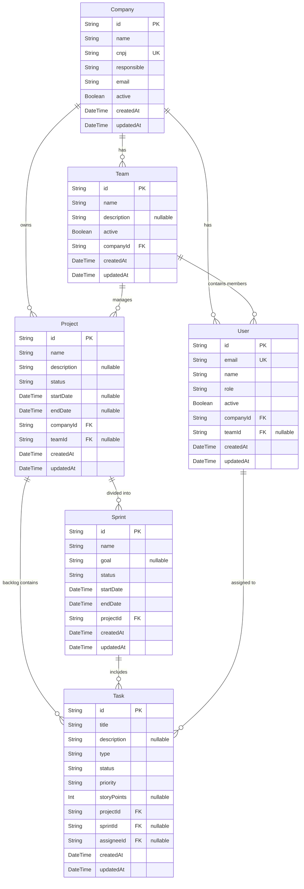

# Modelo Entidade-Relacionamento (MER) - SprintHub

Abaixo está a representação visual da arquitetura de dados atual do SprintHub baseada no seu `schema.prisma`.

## Resumo das Conexões Arquiteturais:
- O **Company (Tenant)** é o coração multi-tenant. Ele é dono de Equipes, Projetos e Usuários.
- A **Team** agrupa **Users** e gerencia múltiplos **Projects**.
- O **Project** aloja diversas **Sprints** (ciclos de tempo) e um Backlog enorme de **Tasks**.
- A **Task** pode estar orfã no Backlog (somente apontando pro `Project`) ou embutida em uma `Sprint` ativa, focada num encarregado (`Assignee`).
